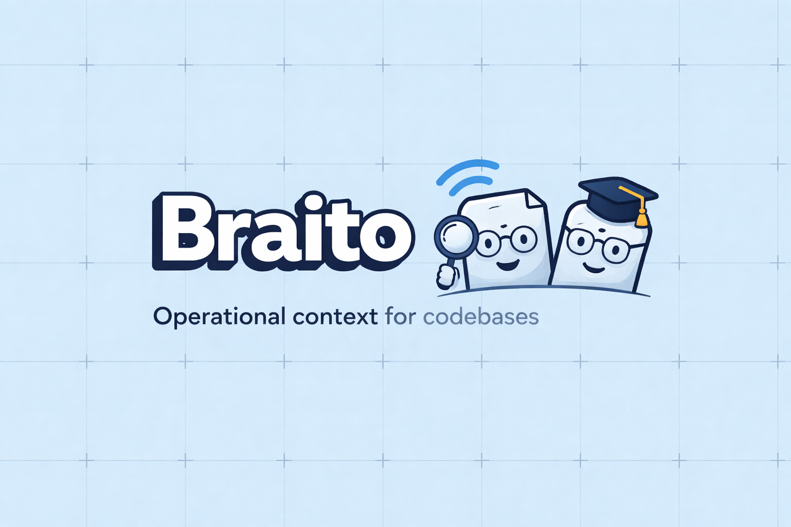

<p align="center">
  
</p>

<p align="center">
  <strong>Operational context for codebases.</strong><br/>
  Braito analyzes TypeScript/JavaScript repos and generates structured knowledge sidecars per file — powered by static analysis, git intelligence, and optional LLM synthesis.
</p>

<p align="center">
  
  
  
</p>

---

## What it does

Braito scans your codebase and generates a `.ai-notes/` directory with one `.json` + `.md` sidecar per file. Each note contains:

| Field | Description |
|---|---|
| `purpose` | What the file does |
| `invariants` | Contracts and assumptions that must hold |
| `sensitiveDependencies` | Risky imports, env vars, external APIs |
| `importantDecisions` | Non-obvious architectural choices |
| `knownPitfalls` | Common failure modes |
| `impactValidation` | Where to verify before shipping — including real coverage data |
| `criticalityScore` | 0–1 heuristic — drives LLM prioritization |

Every field separates **`observed`** (static analysis, git, tests) from **`inferred`** (LLM synthesis). No hallucination hiding in the facts.

---

## Pipeline

```
repo → scanner → AST analyzer → graph engine → git intelligence
     → [cache check] → static note → [LLM synthesis] → .ai-notes/
```

**Key constraint:** LLM is only invoked when `criticalityScore >= llmThreshold` (default `0.4`). The rest of the pipeline is fully deterministic and auditable.

---

## Quickstart

```bash
# Install dependencies
bun install

# Discover eligible files
bun src/cli/index.ts scan --root ./

# Discover eligible files — machine-readable JSON output
bun src/cli/index.ts scan --root ./ --format json

# Full pipeline — writes .ai-notes/
bun src/cli/index.ts generate --root ./

# Bypass cache, reprocess everything
bun src/cli/index.ts generate --root ./ --force

# Scope to a subdirectory
bun src/cli/index.ts generate --root ./ --filter src/core/**

# Debug mode — verbose output with per-file details and timestamps
bun src/cli/index.ts generate --root ./ --debug

# Verbose — same as debug but without timestamps
bun src/cli/index.ts generate --root ./ --verbose

# Silent — suppress all output except errors
bun src/cli/index.ts generate --root ./ --silent
# Show field-level diff between old and new notes (useful for PR review)
bun src/cli/index.ts generate --root ./ --diff

# Watch mode — regenerates on file change
bun src/cli/index.ts watch --root ./

# MCP server — expose notes to AI assistants (Cursor, Claude Code)
bun src/cli/index.ts mcp --root ./

# Local web UI
bun src/cli/index.ts ui --root ./

# Run tests
bun test
```

---

## Configuration

Create an `ai-notes.config.ts` at the root of your project:

```ts
// Ollama — local, no API key needed
export default {
  llm: { provider: 'ollama', model: 'llama3', llmThreshold: 0.4, temperature: 0.2 }
}

// Anthropic
export default {
  llm: { provider: 'anthropic', model: 'claude-sonnet-4-6', llmThreshold: 0.4 }
  // or set ANTHROPIC_API_KEY env var
}

// OpenAI
export default {
  llm: { provider: 'openai', model: 'gpt-4o', llmThreshold: 0.4 }
  // or set OPENAI_API_KEY env var
}
```

### Stale note detection

Notes older than `staleThresholdDays` (default: 30) are flagged with ⚠ in `index.md` and logged on `generate`. Configure via:

```ts
export default { staleThresholdDays: 14 }
```

### Multi-language support

Python (`.py`) and Go (`.go`) are supported via opt-in:

```ts
import { MULTI_LANGUAGE_INCLUDE } from './src/core/config/defaults.ts'
export default { include: MULTI_LANGUAGE_INCLUDE }
```

To add a new language, implement `LanguageAnalyzer` (`src/core/ast/types.ts`) and register it in `analyzerRegistry.ts`.

---

## Generated output

```
.ai-notes/
  src/                              ← grouped by domain
    core/
      scanner/discoverFiles.ts.json   ← structured note
      scanner/discoverFiles.ts.md     ← human-readable sidecar
  index.json                          ← all files ranked by criticalityScore
  index.md                            ← grouped by domain, avg score per group

cache/
  hashes.json                         ← SHA-1 per file for incremental runs
```

Do not edit `.ai-notes/` or `cache/` manually — they are regenerated.

### index.md example

```
## src/core
_12 files · avg criticality 0.54_

| Score | File | Model | Purpose |
|-------|------|-------|---------|
| 0.85 ⚠ | src/core/llm/synthesizeFileNote.ts | static | ... |
```

⚠ marks notes older than `staleThresholdDays`. Run `generate --force` to refresh.

---

## Test coverage integration

If a coverage report exists, braito surfaces real line coverage in `impactValidation`:

- `coverage/lcov.info` (lcov format)
- `coverage/coverage-summary.json` (c8/v8 format)

Files below 50% coverage get a risk warning in their note.

---

## MCP server

Expose braito notes as tools for AI assistants:

```bash
bun src/cli/index.ts mcp --root ./
```

Available tools:

| Tool | Description |
|---|---|
| `get_file_note` | Get the full note for a specific file |
| `search_by_criticality` | List files above a criticality threshold |
| `get_index` | Get the full ranked index |

Add to your MCP client config (e.g. Cursor `~/.cursor/mcp.json`):

```json
{
  "mcpServers": {
    "braito": {
      "command": "bun",
      "args": ["src/cli/index.ts", "mcp", "--root", "/path/to/your/project"]
    }
  }
}
```

---

## Web UI

```bash
bun src/cli/index.ts ui --root ./
# → http://localhost:7842
```

Browse notes grouped by domain, filter by criticality score, search by filename, and view all fields per file.

---

## Architecture

| Layer | Path | Responsibility |
|---|---|---|
| CLI | `src/cli/` | Command orchestration — `scan`, `generate`, `watch`, `mcp`, `ui` |
| Scanner | `src/core/scanner/` | File discovery via `Bun.Glob`, include/exclude/ignore rules |
| AST | `src/core/ast/` | `ts-morph` for TS/JS; `LanguageAnalyzer` interface + registry; Python and Go analyzers |
| Graph | `src/core/graph/` | Direct + reverse dependency graphs; bundler alias resolution (Vite, Webpack, Metro); incremental updates |
| Git | `src/core/git/` | Churn score, recent commits, co-changed files, author count |
| Tests | `src/core/tests/` | Heuristic test discovery; lcov/c8 coverage integration |
| Cache | `src/core/cache/` | SHA-1 per file, skip unchanged files, stale note detection |
| LLM | `src/core/llm/` | Provider abstraction, prompt builder, Zod schema validation, merge strategy |
| Output | `src/core/output/` | JSON/Markdown serialization, domain-grouped index, sidecar writing |

---

## CI integration

`.github/workflows/ai-notes.yml` triggers on push to `main`/`master` when source files change.

Requires:
- `fetch-depth: 0` — full git history for accurate churn signals
- `ANTHROPIC_API_KEY` or `OPENAI_API_KEY` as repository secrets (if using cloud providers)

---

## Where it shines

- TypeScript monorepos
- React, React Native, Node.js projects
- Python and Go codebases (opt-in)
- Codebases with lots of implicit rules
- Teams using AI for code review, onboarding, and maintenance

---

## Principles

1. **Static analysis first** — the majority of the pipeline is deterministic. LLM enriches, not replaces.
2. **Reduced context per file** — never send the entire repo to the model.
3. **Observed vs inferred** — always separated, always explicit.
4. **Sidecar, not inline** — notes live in `.ai-notes/`, not as code comments.
5. **Criticality-driven** — high-churn, high-consumer, and hook-heavy files are prioritized.
